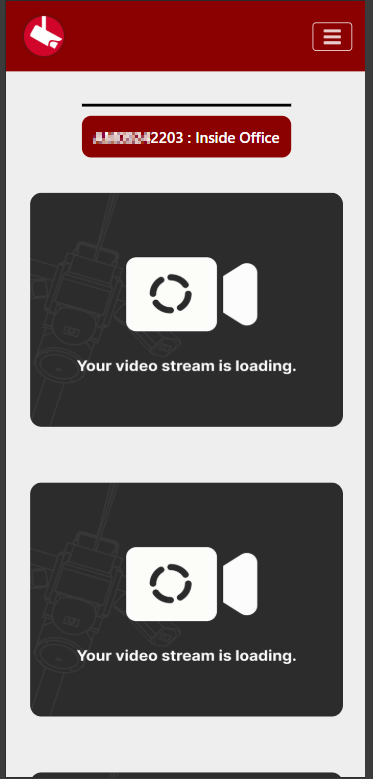
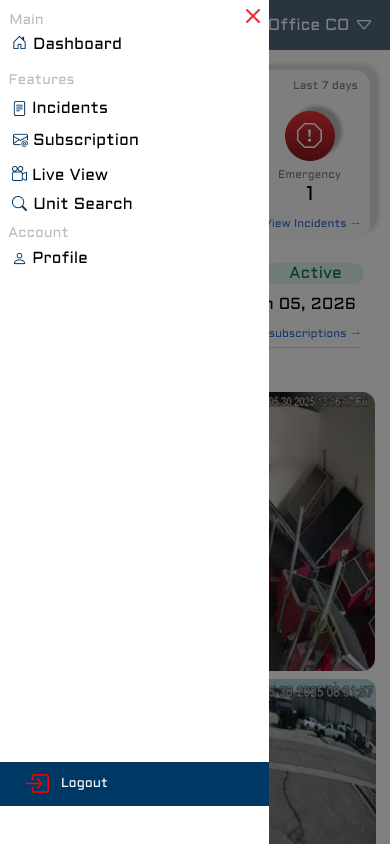
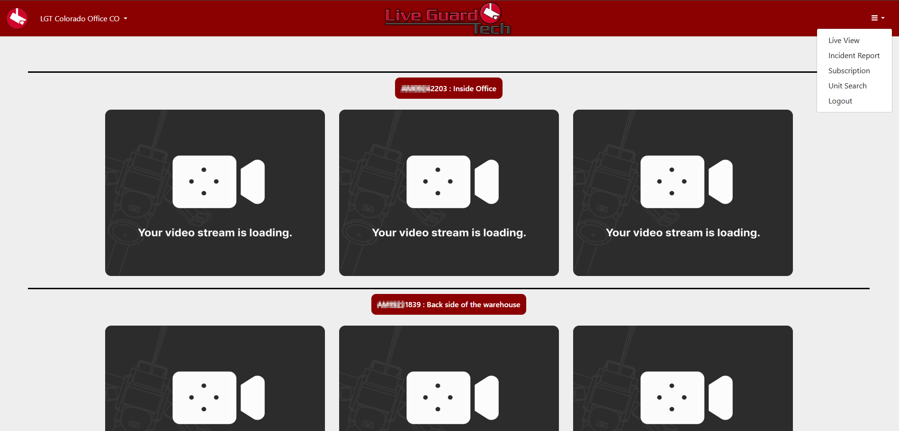
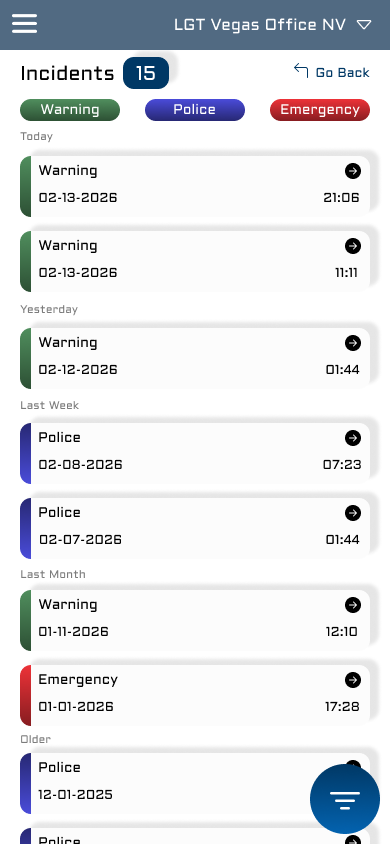

# 📹 CamView – UX/UI Redesign Case Study

**English** | [Español](./README.es.md)

> 🛠️ Role: Frontend Developer / UX Thinker  
> 🧠 Context: Redesign of a production product  
> 🎯 Focus: UX, UI, navigation, efficiency, and mobile-first

## Before vs After

### 📱 Mobile

| Before | After |
|------|--------|
|  |  |

| Navigation (Before) | Navigation (After) |
|-------------------|---------------------|
|  |  |

---

### 💻 Desktop

| Before | After |
|------|--------|
|  |  |

| Navigation (Before) | Navigation (After) |
|-------------------|---------------------|
|  |  |

---

## Context

CamView is a web app that allows users to monitor security cameras in real time, review reports, and interact with different parts of the system.

Through continuous use, multiple friction points were identified—especially around navigation, information consumption, and the mobile experience.

This redesign focuses on improving clarity, efficiency, and accessibility.

---

## Problems identified

### 📱 Mobile

- ❌ Non-responsive tables that are hard to consume  
- ❌ Hidden navigation with multiple steps  
- ❌ Touch interaction not optimized  
- ❌ Information overload with no hierarchy

---

### 💻 Desktop

- ❌ Poorly structured layout  
- ❌ Inefficient use of space  
- ❌ Lack of visual consistency  
- ❌ Hard to identify key actions

---

## ⚖️ Key comparisons (design decisions)

### 🔹 Navigation

| Before | After |
|------|--------|
|  |  |

**Problem:**  
- Hidden, low-access navigation

**Solution:**  
- Persistent sidebar, organized by sections

**Impact:**  
- Faster access to features  
- Reduced navigation friction

---

### 🔹 Reports

| Before | After |
|------|--------|
|  |  |

**Problem:**  
- Tables are hard to read and use on mobile

**Solution:**  
- Visual redesign + dedicated filters

**Impact:**  
- Better readability  
- More efficient analysis

---

### 🔹 Subscription

| Before | After |
|------|--------|
|  |  |

**Problem:**  
- Long, separated flow

**Solution:**  
- Converted into a contextual modal

**Impact:**  
- Fewer steps  
- Faster interaction

---

### 🔹 Unit search

| Before | After |
|------|--------|
|  |  |

**Problem:**  
- Unclear flow

**Solution:**  
- Optimized flow + clearer results

**Impact:**  
- Better search experience  
- Less confusion

---

## ✨ Final result (new experience)

### 📱 Mobile

- Centralized Dashboard  
- Accessible sidebar  
- Optimized LiveView  
- Report filters (new feature)  
- Improved search  
- Modals for quick actions

---

### 💻 Desktop

- Fixed navbar  
- Better use of space  
- Clear visual hierarchy  
- Consistency across views

---

## 🧠 Design decisions

- **Persistent sidebar** → reduces cognitive load and improves navigation  
- **Dashboard** → centralizes critical information  
- **Modals** → reduce friction in key flows  
- **Mobile-first** → ensures a consistent experience across devices  
- **Report filters** → enable more efficient analysis  
- **Improved visual hierarchy** → supports readability and decision-making

---

## 🎯 Outcome / Impact

This redesign transforms CamView into:

- ✔ Clear, accessible navigation  
- ✔ Fewer steps for key tasks  
- ✔ Better information consumption  
- ✔ Consistent cross-device experience  
- ✔ Stronger focus on users’ primary actions

---

## Conclusion

This project represents not only a visual change, but an end-to-end improvement of the user experience—focused on efficiency, clarity, and scalability.

It reflects a user-centered approach grounded in real product problems and decisions.

---