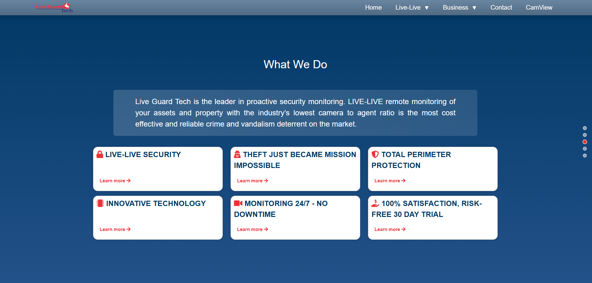
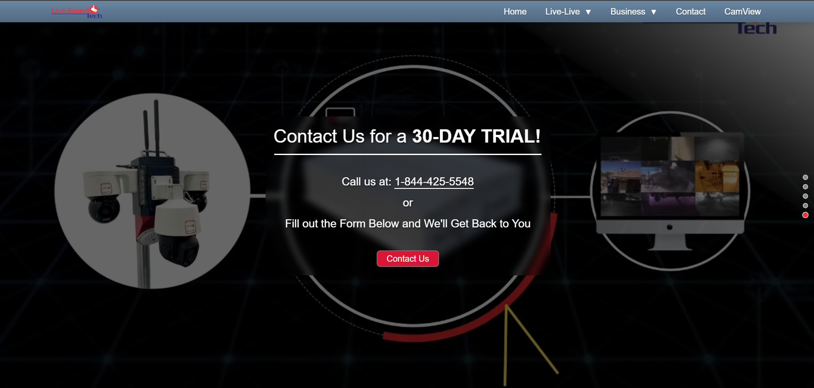
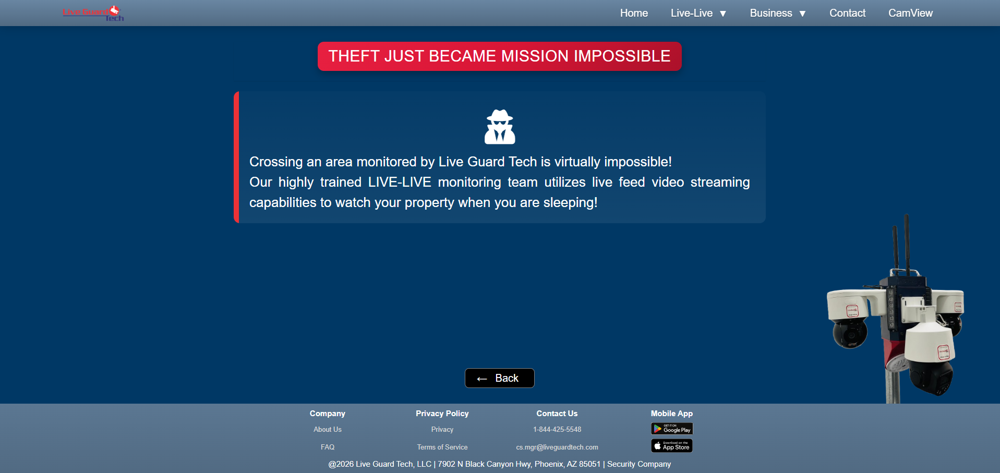
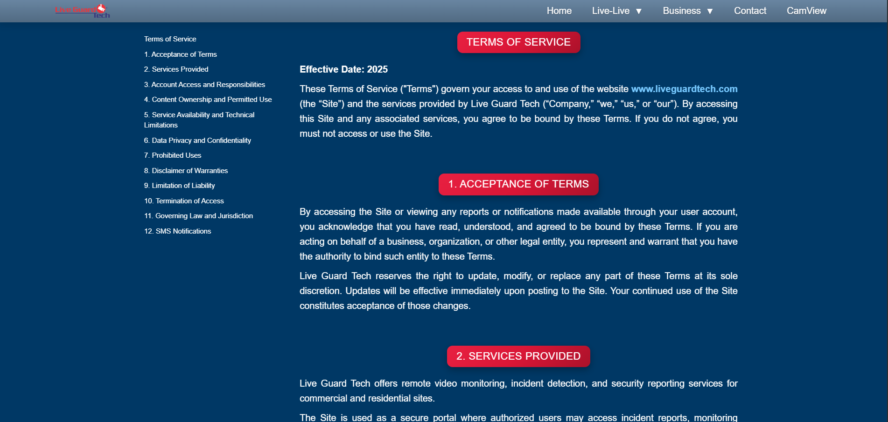
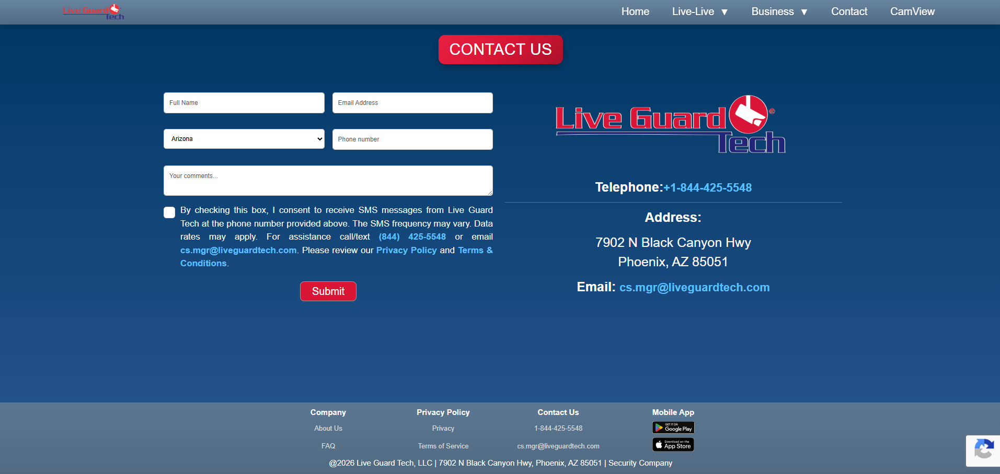

# Website UI Redesign

**English** | [Español](./README.es.md)

> 🛠️ Role: Frontend Developer / UI Designer  
> 🎯 Focus: UI, branding, and product perception  
> 🔗 Live site: [Visit website](https://www.liveguardtech.com/)

---

## Context

The corporate website is often the first touchpoint between the company and potential customers.

However, the existing version didn’t reflect the level of professionalism of the service being offered.

---

## ⚠️ Problem

The previous design had:

- Outdated look and feel  
- Weak visual hierarchy  
- Inconsistent use of color  
- Low content clarity  
- Responsiveness issues across devices

---

## Before

This resulted in:

- Lower visual trust  
- Harder to understand the value proposition  
- Less engaging experience

---

## 🎯 Goal

> Create a modern, clear, professional experience that reflects service quality.

---

## Redesign

Significant improvements to the design and the navbar hover effects.

### New visual identity

- Palette based on blue tones
- Better contrast and readability

## Typography

- Improved information hierarchy

### Layout

- Clearly defined sections
- Better use of whitespace
- Improved visual scanning

### Navigation

- Clearer and more intuitive
- Faster access to key sections

---

## Comparisons

### Before vs After

### Before

### After

---

### Before

Large red banner.

---

### After

Improved the design and added motion by using a background video.

---

### Before

### After

---

### Before

Low hierarchy in headings.

---

### After

Headings were updated to match the style of other pages, keeping consistency across the visual system.

---

### Before

### After

---

## Impact

- Better brand perception  
- Improved clarity of offered services  
- More professional experience  
- Better first impression for customers

---

## Learnings

- UI defines user trust  
- Good design communicates before content  
- Simplicity improves the experience  
- Web design is also a business tool

---

## 🔗 Live site

https://www.liveguardtech.com

